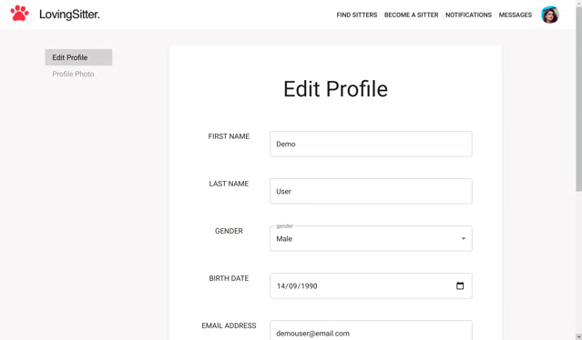
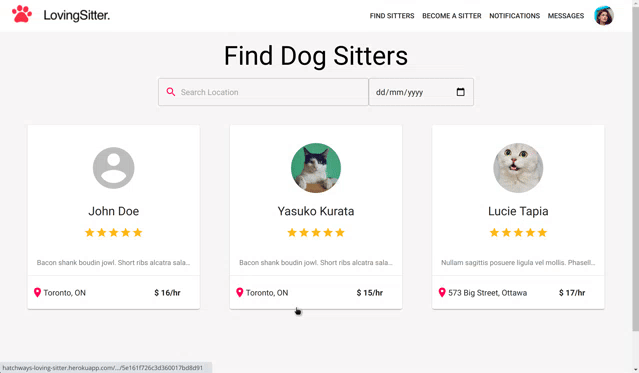
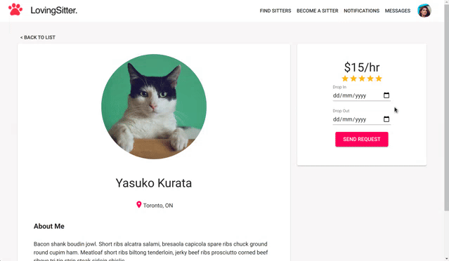
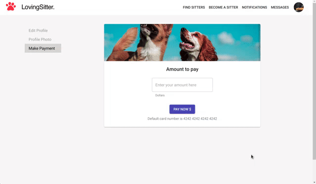
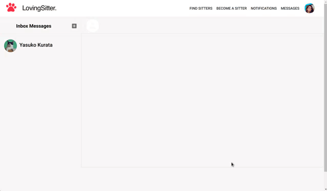
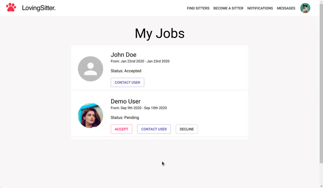

# About this App

This application is for dog owners who may often or occasionally need to find a dog sitter,
and dog sitters who have spare time and would like to earn some extra money dog sitting.
This app allows dog owners to see dog sitter's profiles and reviews, so dog owners are able to find and book the top rated dog sitters.

## Requirements

The following software is required to be installed on your system:

- NodeJS
  - The project uses NodeJs as a backend language. Make sure you have [NodeJS] installed.

[nodejs]: https://nodejs.org/en/download/

- MongoDB
  - The project uses MongoDB as a database. Installation tutorial is [here].

[here]: https://docs.mongodb.com/manual/installation/

## Getting Started

- To get started, clone the repo to your local machine.

  `https://github.com/hatchways/team-hazelnut.git`

- Install all dependencies on the both front end and back end.

  **Frontend (Client)**

  - Go to client directory, and run `npm install`.

  - To start client, run `npm start`.

  **Backend (Server)**

  - Go to server directory, and run `npm install`.

  - To start server, run `npm start`.

- Ensure that you have MongoDB installed globally on your system.

  - Open Command or Command Prompt and run `mongod (or sudo mongod)` to start
    the MongoDB daemon.

## Build with

- Backend

  - Node
  - Express
  - MongoDB
  - AWS S3 bucket
  - Stripe (Online payment)

- Frontend
  - React
  - Redux
  - Material-UI

## Features

### Authentication with JSON Web Token.

Hash password with bcrypt and generate a token in server.
Store the token in the local storage when user logged in.

  

    
 
 

### Create a profile.

User can create a profile with name, location, hourly rate, etc.
Once user created the profile, saved profile is displayed on the profile form and user can edit the form.

  

    
 
 

### Search dog sitters by location.

There is a search input for location. User can filter the dog sitters by location.

  

    
 
 

### Send requests to potential sitters.

From the dog sitter's detail page, user can send a request to dog sitters by selecting drop in date and drop out date.

  

    
 
 

### Make payment for dog sitting fee.

User can make payments for dog sitting fee by entering the amount to pay and clicking the pay now button.

  

    
 
 

### Real time messaging between the dog owner and the dog sitter.

The dog owner and the dog sitter are able to communicate through real time messaging. In the message page, by clicking the Plus sign on the lnbox, user can find the dog sitter who needs to contact.

  

    
 
 

### Dog sitters can approve or deny requests.

Once requests are sent, dog sitters are able to see all requests from My Jobs page. User can select Approve or Decline the request.

  

    
 
 

## Authors

- Shawn Pang
- Kartihan Srisaravanapavan
- Ramazan Ushpayev
- Yasuko Kurata
