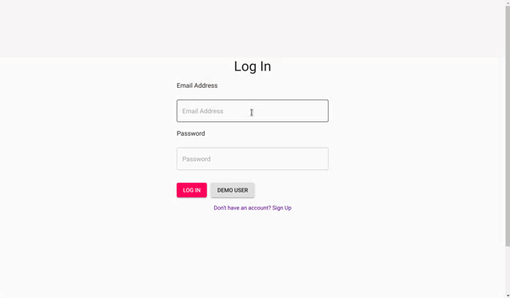

# About this App

This application is for dog owners who may often or occasionally need to find a dog sitter,
and dog sitters who have spare time and would like to earn some extra money dog sitting.
This app allows dog owners to see dog sitter's profiles and reviews, so dog owners are able to find and book the top rated dog sitters.

## Requirements

The following software is required to be installed on your system:

- NodeJS
  - The project uses NodeJs as a backend language. Make sure you have [NodeJS] installed.

[nodejs]: https://nodejs.org/en/download/

- MongoDB
  - The project uses MongoDB as a database. Installation tutorial is [here].

[here]: https://docs.mongodb.com/manual/installation/

## Getting Started

- To get started, clone the repo to your local machine.

  `https://github.com/hatchways/team-hazelnut.git`

- Install all dependencies on the both front end and back end.

  **Frontend (Client)**

  - Go to client directory, and run `npm install`.

  - To start client, run `npm start`.

  **Backend (Server)**

  - Go to server directory, and run `npm install`.

  - To start server, run `npm start`.

- Ensure that you have MongoDB installed globally on your system.

  - Open Command or Command Prompt and run `mongod (or sudo mongod)` to start
    the MongoDB daemon.

## Build with

- Backend

  - Node
  - Express
  - MongoDB
  - AWS S3 bucket

- Frontend
  - React
  - Redux
  - Material-UI

## Features

- Authentication with JSON Web Token.

  

    
 
 
- Create a profile.
- Search dog sitters by location.
- View dog sitters profiles.
- Send requests to potential sitters.
- Real time messaging between the dog owner and the dog sitter.
- Dog sitters can approve or deny requests.

## Authors

- Shawn Pang
- Kartihan Srisaravanapavan
- Ramazan Ushpayev
- Yasuko Kurata
